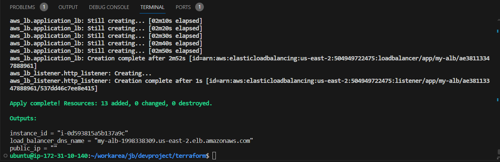

# AWS EC2 + ALB Deployment using Terraform, Jinja2, and Boto3

## 📄 Code Explanation

When running `main.py`, it loads the `ec2_with_alb.j2` Jinja2 template and renders it into a Terraform file using the inputs provided by the user or receives predefined input.

- Then, it runs:
  - `terraform init`
  - `terraform plan`
  - `terraform apply`
- After deployment, it prints the Terraform output (or any errors).

`validate.py`:
- Fetches Terraform output (like EC2 instance ID and ALB DNS name).
- Uses **Boto3** to validate:
  - EC2 instance exists and is running
  - Load Balancer exists and is reachable
- Saves the validation results into a file called `aws_validation.json`.

---

Project Structure:

├── main.py # Main deployment script using Jinja2 and python-terraform

├── validate.py # Validation script using Boto3

├── templates/

│ └── ec2_with_alb.j2 # Jinja2 Terraform template

├── terraform/ # Generated Terraform files (main.tf, outputs.tf)

├── aws_validation.json # JSON output from Boto3 validation

├── infra_diagram.png # (Optional) Architecture diagram

└── README.md # You're reading it
